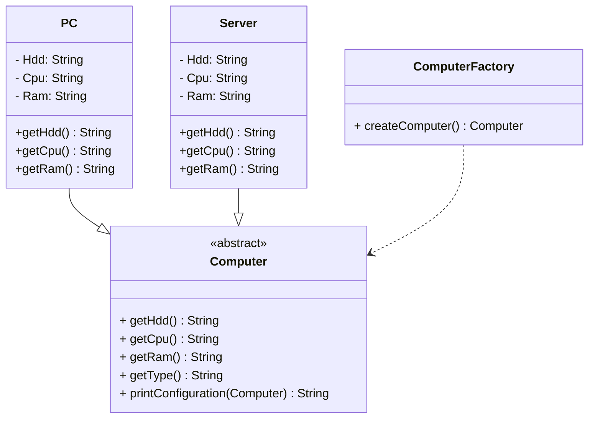
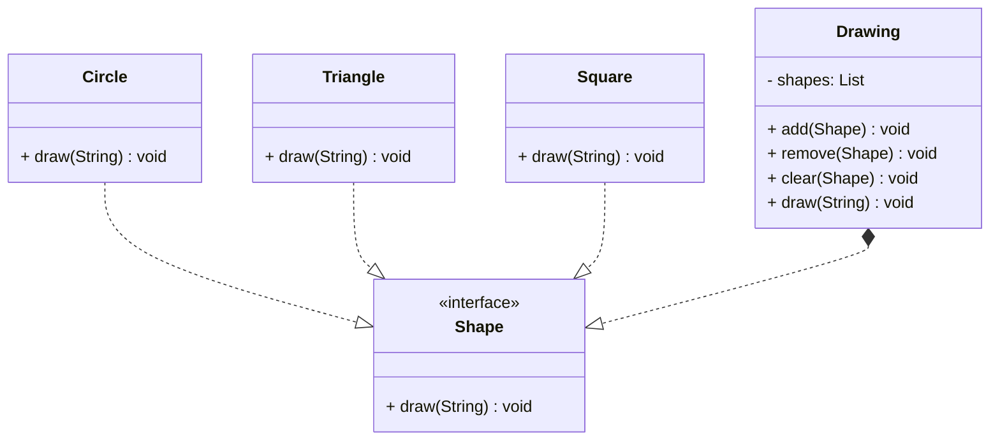

## Factory

```mermaid
classDiagram
    class Computer {
        <<abstract>>
        + getHdd() String
        + getCpu() String
        + getRam() String
        + getType() String
        + printConfiguration(Computer) String
    }

    class ComputerFactory {
        + createComputer() Computer
    }

    class PC {
        - Hdd: String
        - Cpu: String
        - Ram: String

        +getHdd() String
        +getCpu() String
        +getRam() String
    }

    class Server {
        - Hdd: String
        - Cpu: String
        - Ram: String

        +getHdd() String
        +getCpu() String
        +getRam() String
    }

    PC --|> Computer
    Server --|> Computer
    ComputerFactory ..> Computer


```

## Composite

```mermaid
classDiagram
    class Drawing {
        - shapes: List<Shape>
        + add(Shape) void
        + remove(Shape) void
        + clear(Shape) void
        + draw(String) void
    }

    class Circle {
        + draw(String) void
    }

    class Triangle {
        + draw(String) void
    }

    class Square {
        + draw(String) void
    }

    class Shape {
        <<interface>>
        + draw(String) void
    }

    Circle ..|> Shape
    Triangle ..|> Shape
    Square ..|> Shape
    Drawing *..|> Shape

```